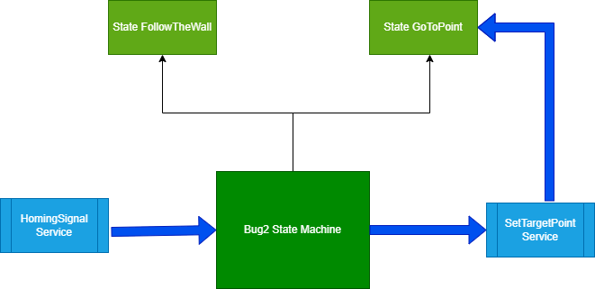

This is the repository hosting Group 16 ROS solution. 

Main commands :
There are 3 sh script files that will start Gazebo simulation with a Robot inside:

* ./run_bug2_simulator_random_world.sh

This will run bug2 algorithm in a random world. Random world is map constructed during runtime with random obstacles and walls.

* ./run_bug2_simulator_resources_world.sh

This will run bug2 algorithm in the default world found in the asessement's resource folder.

* ./run_bug2_simulator_random_world_4_wheels.sh

This is similar to run_bug2_simulator_random_world.sh but it will spawn a 4 wheel rover Robot, we created as an extra urdf model.

* ./run_bug2_simulator_random_world_xarco.sh

This will run bug2 algorithm in a random world. Random world is map constructed during runtime with random obstacles and walls. This is the same as singleGroup16Bot Robot, but is it's xarco version. We keep both to demonstrate that regardless if urdf is in xarco for or a single urdf file with no macro, it should behave the same.

* ./run_bug0_simulator_random_world.sh

This is similar to run_bug2_simulator_random_world but running everything with Bug0 algorithm, a dummy version of Bug2 with main characteristic, the absence of a line to target and a logic to keep the line. This is very likely that it can cause stuck in obstacles forever.

Those scripts will start Gazebo and the robot should start wandering towards random points. Everytime it reaches it's random points it will head to a new random point and if it covered by an obstalce the robot will stay round the obscacle. 

To set a target point the user needs to use homing_signal service. This service will let the Robot that wandering is over there a final resting place (target point) which the Robot have to reach and stop moving. The service can be called like this :
* rosservice call /homing_signal "x: 4.0 y: 4.0"

Where x and y is the target point.

State Machine Diagram

